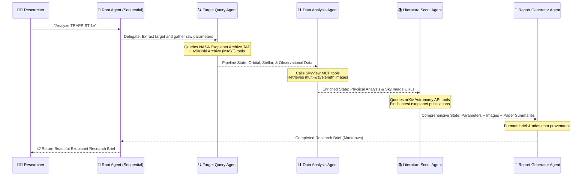

# 🔭 StarForge — AI-Powered Multi-Agent Exoplanet Research Assistant

[](#)
[](#)
[](#)

StarForge is an autonomous exoplanet research pipeline that queries scientific databases, analyzes observational astronomy datasets, retrieves multi-wavelength sky imagery, scouts relevant scientific literature, and synthesizes publication-quality research briefs.

Built for the **AI Agents: Intensive Vibe Coding Capstone Project (June 2026)** course, StarForge demonstrates deep orchestration using **Google ADK (Agent Development Kit)**, **Model Context Protocol (MCP)**, **Sequential Agent Delegation**, and **persistent SQLite session state**.

---

## 🌌 System Architecture & Data Flow

StarForge orchestrates a collaborative network of four specialized agents using a sequential pipeline. Each agent executes in turn, carrying out complex data gathering or analysis tasks via custom MCP tools before passing its results down the chain.



---

## 🛠️ Built-in Custom MCP Servers

StarForge builds and deploys 4 custom MCP servers that expose real-time astronomical tools directly to the LLM.

1. **NASA Exoplanet Archive MCP** (`mcp_servers/exoplanet_archive/`):
   - `search_planets(query)`: Search confirmed planets matching a query.
   - `get_planet_parameters(planet_name)`: Get complete physical/orbital parameters (mass, radius, period, temperature) via POST-based TAP sync query to Caltech.
   - `get_stellar_parameters(star_name)`: Retrieve host star mass, radius, effective temperature, and luminosity.
   - `get_discovery_statistics()`: Get global exoplanet counts categorized by discovery method.
   - `list_habitable_zone_planets(limit)`: Search the database for planets matching temperature and mass criteria.

2. **MAST (STScI) Archive MCP** (`mcp_servers/mast_archive/`):
   - `search_observations(target, mission)`: Search Mikulski Archive observations (Hubble, Kepler, TESS, JWST) by target coordinate name.
   - `get_available_missions(target)`: Summarize which missions have target data.
   - `get_observation_summary(target)`: Compile observation counts and instrument configurations.

3. **NASA SkyView Virtual Observatory MCP** (`mcp_servers/skyview/`):
   - `get_sky_image(target, survey, size_arcmin)`: Generate and retrieve a base64 GIF or direct URL of the sky region (radio, optical, infrared, X-ray).
   - `get_multi_wavelength(target)`: Fetch images from ultraviolet down to infrared.
   - `list_available_surveys()`: List common surveys (e.g. DSS, 2MASS, WISE).

4. **arXiv Astronomy Scout MCP** (`mcp_servers/arxiv_astro/`):
   - `search_papers(query, category)`: Search arXiv astrophysics abstracts (`astro-ph.EP`).
   - `get_paper_abstract(arxiv_id)`: Retrieve full abstracts of key papers.
   - `find_related_papers(arxiv_id)`: Automatically extract keywords and locate related literature.
   - `search_recent_papers(topic, days)`: Track fresh publications.

---

## 🚀 Setup & Installation

### 1. Prerequisites
- Python 3.11 or higher
- Git
- Google AI Studio API Key (for Gemini 2.5 Flash via ADK)

### 2. Clone the Repository & Set up Environment
```bash
git clone <repository-url> starforge
cd starforge
```

### 3. Initialize Virtual Environment & Install Dependencies
```bash
python3 -m venv .venv
source .venv/bin/activate
pip install -e .
```

### 4. Configure Environment Variables
Copy `.env.example` to `.env` and fill in your Gemini API key:
```bash
cp starforge/.env.example starforge/.env
```
Open `starforge/.env` and update:
```env
GOOGLE_API_KEY=your-actual-api-key-here
NASA_API_KEY=DEMO_KEY
```

---

## 🖥️ Usage

### Running the Web UI (Gradio)
The Gradio web interface features a stunning dark-theme cosmic dashboard, allowing you to run research, view sky images, and manage your exoplanet watchlist.
```bash
python starforge/ui/app.py
```
Open the local URL (typically `http://127.0.0.1:7860`) in your browser.

### Running the Programmatic Demo
You can execute the entire multi-agent pipeline programmatically to generate and save a research brief to disk:
```bash
python starforge/demo/demo_trappist1.py
```
This saves the completed markdown brief to `starforge/demo/sample_reports/trappist1e_brief.md`.

### Running the Test Suite
StarForge comes with a comprehensive suite of unit and integration tests (including mock LLM harnesses to test agent chains offline):
```bash
# Test custom MCP tools
python starforge/tests/test_mcp_quick.py

# Test agent orchestration workflow end-to-end
pytest starforge/tests/test_agents.py -v
```

---

## 🏆 Capstone Submission Checklist

- **GitHub Repository** containing all code & servers.
- **Kaggle Writeup** detailing motivation and agent configuration.
- **Gradio Dashboard** with interactive search and watchlist persistence.
- **SQLite Database** storing session events and memory watchlists at `~/.starforge/`.
