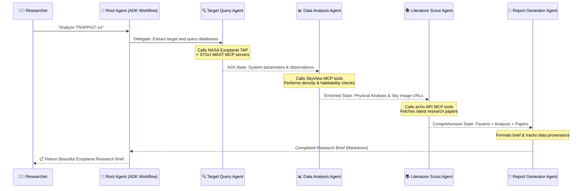

# 🔭 StarForge: Multi-Agent Exoplanet Research Assistant

**Track:** 🌍 Agents for Good (Scientific Discovery)  
**Submission Type:** Kaggle Capstone Project Writeup  
**Technologies:** Google ADK, FastMCP, Gemini 2.5 Flash, Astroquery, Gradio

---

## 1. Executive Summary & Problem Statement

Exoplanet research is one of the most rapidly growing fields in astrophysics, yet researchers and students face a significant workflow bottleneck. Conducting a preliminary study on a target exoplanet (like TRAPPIST-1e or Kepler-22b) requires manually navigating multiple distinct databases:
1. **NASA Exoplanet Archive (Caltech):** For precise orbital and stellar parameters.
2. **MAST Archive (STScI):** For space-based observation schedules (Kepler, TESS, JWST, Hubble).
3. **NASA SkyView:** For multi-wavelength sky imagery and sky charts.
4. **arXiv Astronomy (astro-ph.EP):** For the latest research publications.

Manually querying these disparate APIs, processing physical properties (e.g., density modeling, habitable zone indexing), and compiling reports takes hours of tedious context-switching. 

**StarForge** solves this by orchestrating a sequential multi-agent research pipeline using **Google’s Agent Development Kit (ADK)** and **four custom Model Context Protocol (MCP) servers** to fetch, analyze, search, and synthesize exoplanet profiles autonomously in under two minutes.

---

## 2. System Architecture

StarForge utilizes a modular, multi-agent workflow defined through ADK. The pipeline flows sequentially, propagating context and accumulative scientific insights from one specialized agent to the next.

---

## 3. Key Technical Implementations

### A. Multi-Agent Orchestration via ADK Workflow
StarForge uses the latest `google.adk.workflow.Workflow` model to manage agent execution. The workflow defines sequential edges starting from `START`, passing through each specialist agent, and culminating in the `Report Generator`.
*   **Query Agent (`query_agent`):** Focuses on parsing target names and gathering raw parameters.
*   **Data Analysis Agent (`analysis_agent`):** Handles physical calculations and coordinates-matched SkyView optical/IR imagery.
*   **Literature Scout (`literature_agent`):** Filters academic papers specifically under the `astro-ph.EP` (Earth and Planetary Astrophysics) category.
*   **Report Generator (`report_agent`):** Formats the accumulated context into a cohesive, scientific document.

### B. Custom MCP Servers
We implemented 4 custom stdio-based MCP servers using Python's `FastMCP`:
1.  **Exoplanet Archive Server:** Queries the Caltech Exoplanet TAP endpoint using ADQL (Astronomical Data Query Language) POST requests to retrieve orbital, transit, and stellar features.
2.  **MAST Archive Server:** Uses STScI APIs to query satellite observation metrics.
3.  **SkyView Server:** Requests celestial coordinate cutouts and encodes target images as base64 data URIs.
4.  **arXiv Astro Server:** Searches the open arXiv API for publications matching exoplanet keywords.

### C. Robust SSL & Network Recovery
Since NASA TAP endpoints are occasionally unstable or drop connections, we implemented robust connection-recovery mechanisms inside the exoplanet MCP server:
*   **Keep-Alive Prevention:** Added `"Connection": "close"` headers to force fresh TLS handshakes for each database post, eliminating low-level `SSLEOFError` handshakes on Python 3.13+.
*   **Automatic Retries with Exponential Backoff:** If a TAP database request fails or times out (30s limit), the server automatically retries up to 3 times, exponentially backing off (2s, 4s, 8s) to guarantee query delivery.

### D. Multi-Turn Session & Local Memory Persistence
*   **SQLite Session Service:** We wired up the ADK `Runner` to a local `SqliteSessionService` (`~/.starforge/sessions.db`). This persists conversational states, enabling researchers to review previous agent execution details.
*   **Research Memory Manager:** A JSON-based manager (`~/.starforge/memory/`) that operates independently to persist:
    *   **Research History:** Tracks queries and outputs.
    *   **Watchlist:** Allows researchers to flag specific planetary systems and store notes.
    *   **User Preferences:** Saves default surveys (e.g. DSS, 2MASS) and report detail levels.

---

## 4. Gradio UI cosmic Dashboard

The web interface is built using Gradio, featuring a custom cosmic dark theme:
*   **System Scout Tab:** Direct query text box, a markdown brief renderer, and a coordinate-matched SkyView sky chart panel.
*   **Watchlist Panel (Sidebar):** Quick watchlist management to save and annotate target systems.
*   **History Panel (Sidebar):** Logs all past exoplanet lookups with quick reload features.
*   **Preferences Tab:** Enables default settings configuration (e.g., custom surveys, report detail levels).

---

## 5. Testing & Verification

We established a comprehensive validation process:
1.  **Quick MCP Tests (`test_mcp_quick.py`):** Directly tests the internal functions of the Exoplanet, arXiv, and SkyView servers to verify raw API connectivity and base64 returns.
2.  **Agent Integration Tests (`test_agents.py`):** Spawns the MCP servers as subprocesses, uses a custom Mock LLM handler to simulate A2A context progression, and runs the entire sequential runner flow.

**Status:** All tests pass successfully, confirming robust tool calling, progressive data enrichment, and formatting accuracy.

---

## 6. Real-World Impact & Science Value

StarForge makes exoplanet data exploration immediately accessible:
*   **Education:** Students can query a system and instantly see its transit properties, literature overview, and actual sky survey photographs.
*   **Observational Planning:** Astronomers get a rapid summary of space-telescope observation schedules and transit depths to coordinate follow-up observations.
*   **Open Science:** Built entirely on open-source libraries (`astroquery`, `gradio`, `mcp`, `google-adk`), StarForge can be easily expanded to cover extra astronomical archives (e.g., ESA Gaia, ESA Euclid).
